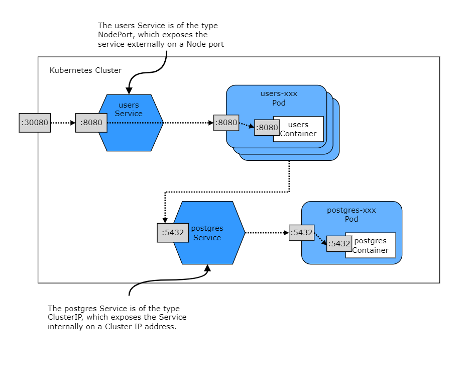

# Go Microservice Template

A full-featured, production-ready microservice template for building applications in Go.  Includes a Users microservice exposing a REST API providing functionality to perform CRUD operations on the resource.

[View the API's OpenAPI Documentation here](https://bruc3mackenzi3.github.io/go-microservice-template/#/)

[Fork this project](https://github.com/bruc3mackenzi3/go-microservice-template/fork) to start building your own REST-based microservice application.


## Tech Stack
* REST API for integrating with other services
* A simple Users service implementing Create, Read, Update, Delete operations on a User resource
  * This simple, generic service acts as a template from which other services can be built
* Go 3rd Party Packages
  * [Echo web framework](https://github.com/labstack/echo)
  * [GORM ORM Library](https://github.com/go-gorm/gorm)
  * [Validator package](https://pkg.go.dev/github.com/go-playground/validator/v10#section-readme) for easy validation of input parameters
  * [Testify](https://github.com/stretchr/testify) Assert and Mock packages for more convenient unit testing
  * [golangci-lint](https://golangci-lint.run/), a popular linter for the Go language
    * Configured with `.golangci.yml` config
    * VSCode Integration configured via  `.vscode/settings.json`
* PostgreSQL database
  * Database schema managed with [GORM Auto-migration](https://gorm.io/docs/migration.html)

### Development
* Makefile for ease of operation
  * Encapsulates commands to build, run, test, clean, etc, the project
* VSCode Integration
  * `launch.json` configurations for:
    * Debugging native application
    * Debugging in Docker container using [Delve debugger](https://github.com/go-delve/delve)
  * `settings.json` configuring VSCode to use golangci-lint
* GitHub Integrations
  * GitHub Actions to run build & tests
  * OpenAPI doc hosted with GitHub Pages
  * Workflow Status Badge showing CI build status
* Docs
  * README.md
  * OpenAPI definition documenting REST API, hosted with GitHub Pages

### Deployment
* CI configured using GitHub Actions
  * This validates changes on every push by building & testing the source code
* Docker for containerizing the application
  * A minimalist base image, `gcr.io/distroless/base-debian10`, is used to keep the build image small
  * Push the image using Docker's public image library.  A free Docker account is required. 
* Kubernetes for deploying the containerized application
  * Objects are defined in Kubernetes manifest files

## Getting Started
Fetch Go dependencies
```
make init
```

Compile the Go application
```
make build
```

Start the database
```
make start-db
```

Run the microservice app directly
```
make run
```

Execute unit tests
```
make test
```

Stop the database
```
make stop-db
```

Get help with all make commands
```
make help
```

Query the application using Curl:
```bash
curl -X POST http://localhost/users/Bruce
curl http://localhost/users/1
```

### Running with Docker
Run the microservice app in Docker
```sh
make d-build
make d-start
```

stop the app
```sh
make stop
```

Rebuild
```bash
docker rm users
make d-build
make d-start
```

### Running in Kubernetes
Precondition: kubectl is installed in your local environment, and connected to a Kubernetes cluster.

First deploy the database:
```sh
kubectl apply -f service.postgres.yaml
```

Next deploy the Users service:
```sh
kubectl apply -f service.users.yaml
```

Tail application logs:
```
kubectl logs -f users
```

The service is exposed externally with a Kubernetes object called a NodePort Service.  This NodePort is exposed externally on port `30080`.  If you're using a local K8s cluster like MiniKube or Docker Desktop, it will be accessible via `localhost`, or `127.0.0.1`:
```
curl http://localhost:30080/v1/users/1
```

The Postgres database is exposed internally only, because in a real world scenario it should not be accessible from outside the Kubernetes cluster.  Assuming your cluster is running locally, you can connect to it by telling Kubernetes to expose the connection:
```
kubectl port-forward postgres 5432
```
Then connect to it as you normally would, e.g.:
```
psql -U microservice
```

Delete application resources created on the cluster:
```sh
kubectl delete service postgres users
kubectl delete pod postgres users
```

Here's how the architecture within Kuberenetes looks:


## Developing
### Kubernetes
To run your changes in Kubernetes follow these steps:

1. Log in to Docker
```
docker login -U username
```

2. Set `DOCKER_USERNAME` in `Makefile` to your Docker username

3. Build and tag the Docker image
```
make d-build
```

4. Push the Docker image to 
```
make d-push
```

5. Deploy to Kubernetes with the instructions under "Running in Kubernetes" above

### Mocks
Update a mock with the following command, e.g. for the `repository.Repository` interface:
```bash
cd repository/
mockery --name Repository --inpackage --outpkg=mock_Repository.go
```

### OpenAPI
The Users API is documented with OpenAPI.  The OpenAPI document is located at [docs/openapi.yaml](docs/openapi.yaml).

There are tools for automating the creation of an OpenAPI document for an API.  The document for this API is updated manually at this time.

A human-readable rendering is hosted with GitHub pages at [github.com/bruc3mackenzi3/go-microservice-template](https://github.com/bruc3mackenzi3/go-microservice-template).  This is enabled in the GitHub repository settings.

For more information on working with OpenAPI, [see the official documentation](https://oai.github.io/Documentation/start-here.html).

For more information on GitHub Pages, [see this getting started page](https://docs.github.com/en/pages/getting-started-with-github-pages/creating-a-github-pages-site).

## ToDo
* BUG: Docker app cannot connect to DB - likely needs a Docker network configured
* Better document API calls
  * Embed CURL commands in README
  * Add Postman Collection
* GitHub integrations
  * CI build with GitHub Actions
    * Add Go lint step to CI.  Additional steps?
    * Test line coverage report
  * PR workflow
    * Require PR for main merge?
    * Block PR merge on CICD passing
* API endpoint implementing pagination
* Cloud deployment
* Integration tests
* Inter-service communication e.g. with gRPC
* Logging
* Context
